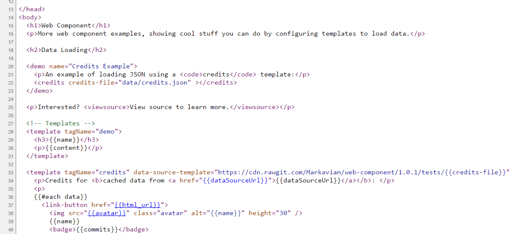
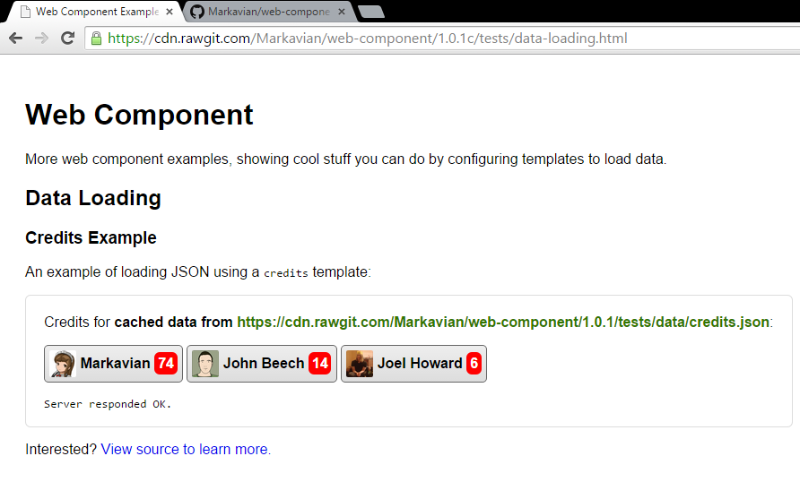

Web Component JS
================
A javascript library for very simply adding data driven web components to a HTML page, by defining your own domain specific, HTML language via templates.

Recent Releases

**Version 1.2.7** (Experimental)
December 4th 2015
* https://cdn.rawgit.com/connected-web/web-component-js/1.2.7/lib/web-component.js

**Version 1.2.6** (Stable)
October 6th 2015
* https://cdn.rawgit.com/connected-web/web-component-js/1.2.6/lib/web-component.js

**Version 1.2.5** (Stable)
July 11th 2015
* https://cdn.rawgit.com/connected-web/web-component-js/1.2.5/lib/web-component.js

**Version 1.2.4** (Stable, supports loading of its own dependencies)
July 6th 2015
* https://cdn.rawgit.com/connected-web/web-component-js/1.2.4/lib/web-component.js

**Version 1.2.0** (Seems stable, old style depdendency errors)
30th June 2015
* https://cdn.rawgit.com/connected-web/web-component-js/1.2.0/lib/web-component.js

Dependencies
------------
- [jQuery](https://jquery.com/) - for remote calls to server to provide components with data
- [Handlebars](http://handlebarsjs.com/) - for "minimal templating on steroids"

What it can do
--------------
Web Component is a javascript library that can convert custom HTML tags, like in this example...



... into rendered content, using client side JavaScript, and template definitions:



Online Demos
------------
* `index.html` : [Web Component JS - Index of Examples](https://cdn.rawgit.com/connected-web/web-component-js/1.2.7/tests/index.html)

Tools
-----
Web Component JS Composer - with Live Editor and JS Packager:
* `tools/composer.html` [Web Component Composer for Creating File Includes](https://cdn.rawgit.com/connected-web/web-component-js/1.2.7/tools/composer.html)

The composer is a great way to play around with new templates and view the results in the live window. It also packs up your script, template and style tags into a JS packaged format which you can distribute via CDN or include by reference into local web pages.

### Sample Data
Some example JSON data to help with the examples:
* `data/credits.json` : [Github Credits](https://cdn.rawgit.com/connected-web/web-component-js/1.2.7/tests/data/credits.json)
* `data/geoNames.json` : [Geo Names](https://cdn.rawgit.com/connected-web/web-component-js/1.2.7/tests/data/geoNames.json)
* `data/monitorStatus.json` : [Monitor Status](https://cdn.rawgit.com/connected-web/web-component-js/1.2.7/tests/data/monitorStatus.json)
* `data/navigation.json` : [Navigation for Examples](https://cdn.rawgit.com/connected-web/web-component-js/1.2.7/tests/data/navigation.json)

Using Web Component JS
----------------------
1. Copy script tags for Web Component JS into the `<head></head>` of your HTML page
2. Define a `<template for="your-custom-element"></template>` tag
3. Insert your custom tags into the page
4. Load the page in a web browser to see your custom tags render

A complete example to get you started:
```html
<!DOCTYPE html>
<html>
<head>
  <title>Web Component Examples - Index</title>
  <script src="https://cdn.rawgit.com/connected-web/web-component-js/1.2.7/lib/web-component.js"></script>

  <style for="page">
    body { padding: 20px; font-family: sans-serif; }
  </style>

</head>
<body>
  <github-repo user="Markavian" repo="web-component"></github-repo>
  <github-repo user="johnbeech" repo="product-monitor"></github-repo>

  <template for="github-repo">
    <h2>Repository</h2>
    <li>
      <a href="https://github.com/{{user}}/{{repo}}/">
        <b>{{user}}</b>/<b>{{repo}}</b>
      </a>
    </li>
  </template>
</body>
</html>
```

Beyond this simple example, Web Component can be used for auto-loading data via jQuery AJAX calls, and re-rendering other components defined by your page template based on these events.

Projects using Web Component
----------------------------
* [Product Monitor](https://github.com/johnbeech/product-monitor/) - for rendering pretty much everything client side.

Local development setup
-------------------
```
npm install http-server -g
http-server
```
Then open http://localhost:8080 in a web-browser of your choice.

Edits can be made to `lib/web-component.js` directly, and you can use the HTML files in `tests/` as harnesses for various situations. Preferred browser for debugging is Chrome.

### Local tests
To run tests against the web-component-js compiler, use:
```
npm test
```
This will run a series of compilation tests that convert sample components into a compiled format, based on a dependency resolution template, and then diff them against an expected output.

Web Component Wiki
------------------

Please see the wiki for documentation and examples on using the Web Component library and extending custom components with your own javascript.
* [Web Component API] (https://github.com/Markavian/web-component/wiki/Web-Component-API)
